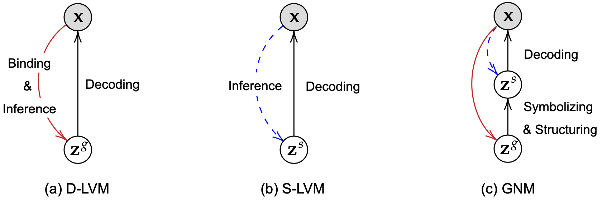
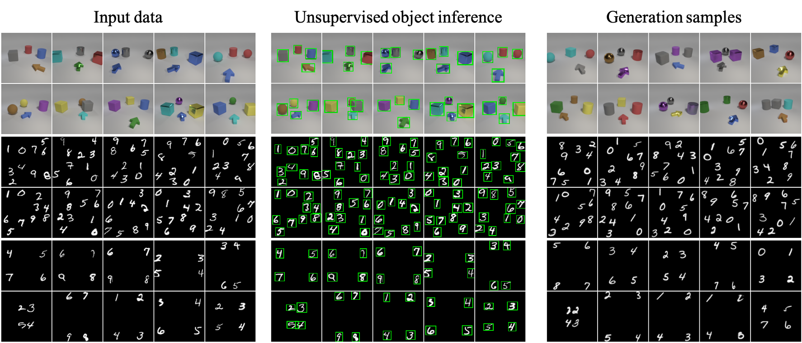

## Generative Neurosymbolic Machines (GNM)

This is the official implementation of [Generative Neurosymbolic Machines](https://arxiv.org/abs/2010.12152) by [Jindong Jiang](https://www.jindongjiang.me) & [Sungjin Ahn](https://sungjinahn.com/); accepted to the *Neural Information Processing Systems* (*NeurIPS*) 2020 as a **🌟Spotlight🌟** paper.



## Qualitative Results



We also provide the generation samples we used to evaluate the scene structure accuracy in the paper in the [generations](generations/) directory.


## Dependencies

This project uses Python 3.7 and PyTorch 1.4.0, but it is also tested on Python 3.8 and PyTorch 1.7.0. 

To install the requirements, first install [Miniconda](https://docs.conda.io/en/latest/miniconda.html) (or [Anaconda](https://www.anaconda.com/products/individual)) then run:

```bash
conda env create -f environment.yml
```

Note that the environment.yml installs PyTorch with cudatoolkit=10.1. If you have another CUDA version installed, you may want to re-install it with the corresponding PyTorch version. See [here](https://pytorch.org).

## Datasets

The datasets used in the paper can be downloaded from the following link:

* [Arrow room](https://bit.ly/2IuTlOM)
* [MNIST-10](https://bit.ly/3ou2juQ)
* [MNIST-4](https://bit.ly/2VRG4D0)

Once you download the datasets, unzip the files into the `data` directory.

## Generation with pretrained models

To help you quickly get a feeling of how the code works, we provide pretrained models and a jupyter notebook for you to generate images for all three environments. These models can be downloaded from the following link. 

* [Arrow room](https://bit.ly/36TkBQl)
* [MNIST-10](https://bit.ly/349pbs3)
* [MNIST-4](https://bit.ly/3lR5YkF)

Please put the downloaded checkpoints (`.pth` files) to the `pretrained` directory and use the `generation.ipynb` to play with them.


## Training

To train the model, use the following command:

```
python train.py --config-file config/[configuration].yaml
```

The configuration files for all three datasets are provide in the `config` folder. You may also want to specify the GPU you use for training by setting the `CUDA_VISIBLE_DEVICES ` variable.

The training process includes the visualization and log-likelihood computation. Note that the log-likelihood computation is only for logging, final LL value should be computed using more particles in importance sampling, we use 100 for computing the results in the paper.

## Citation

If you find our work useful to your research, please feel free to cite our paper:

```latex
@article{jiang2020generative,
  title={Generative Neurosymbolic Machines},
  author={Jiang, Jindong and Ahn, Sungjin},
  journal={NeurIPS},
  year={2020}
}
```

## Additional comments

* We didn't fix the random seed when generating the samples, so it is very difficult to generation the exact same images we provided in [generations](generations/) directory, but feel free to generate more using the pretrained models and the jupyter notebook.
* This project uses [YACS -- Yet Another Configuration System](https://github.com/rbgirshick/yacs), which is a very nice configuration library for arguments management, please also check their repo for more information.
* The `README.md` template is partially taken from [G-SWM](https://github.com/zhixuan-lin/G-SWM) and [SCALOR](https://github.com/JindongJiang/SCALOR)
